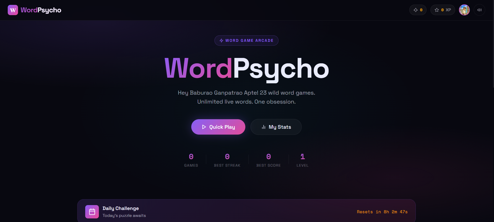

# 🧠 WordPsycho

> **A modern browser-based word-game arcade built for fast thinking, vocabulary, pattern recognition, and word-solving skills.**

**WordPsycho** is an interactive single-page word-game platform that brings multiple word challenges together in one immersive experience. Players can test their vocabulary, speed, spelling, pattern recognition, and problem-solving abilities through different game modes.

---

## ✨ Features

* 🎮 **Multiple Word Games**
* ⏱️ **Timed Challenges**
* 🏆 **Score & Performance Tracking**
* ⚡ **XP & Progression System**
* 🎖️ **Achievements**
* 💡 **Hints & Assistance**
* ⌨️ **Keyboard-Friendly Gameplay**
* 📊 **Game Statistics**
* 🌙 **Immersive Dark UI**
* 📱 **Responsive Interface**
* 🔄 **Dynamic Game & Result Screens**

---

## 🎯 Game Modes

WordPsycho includes a collection of different word-based challenges:

| Mode                    | Description                                                |
| ----------------------- | ---------------------------------------------------------- |
| 🧩 **Word Questions**   | Solve vocabulary and word-based questions                  |
| 🔗 **Word Chain**       | Continue a chain by connecting words                       |
| 🔀 **Word Scramble**    | Unscramble letters to discover the correct word            |
| 🪜 **Word Ladder**      | Transform one word into another through valid word changes |
| ⌨️ **Typing Challenge** | Test typing speed and accuracy                             |
| 💀 **Hangman**          | Guess the hidden word before running out of attempts       |
| 🟩 **Wordle-style**     | Deduce the target word using progressive clues             |

---

## 🕹️ Gameplay

Each game mode provides its own challenge while contributing to the overall player experience.

Players can:

1. Select a game mode
2. Start a challenge
3. Solve the word problem
4. Earn points based on performance
5. Gain XP and unlock achievements
6. Review their results and statistics
7. Continue playing different modes

The system is designed around **speed, accuracy, vocabulary, and decision-making**.

---

## 🏆 Progression System

WordPsycho isn't just about completing individual games.

The platform incorporates progression mechanics including:

* **Score**
* **XP**
* **Achievements**
* **Streaks**
* **Performance statistics**
* **Game completion tracking**

This creates a lightweight arcade-style progression system that encourages players to improve over repeated sessions.

---

## 🎨 Interface

WordPsycho uses a modern dark-themed interface focused on:

* Clean visual hierarchy
* High-contrast game elements
* Minimal distractions
* Interactive cards and controls
* Responsive layouts
* Fast game transitions
* Clear feedback during gameplay

The interface is designed to feel more like a **modern digital game platform** than a traditional vocabulary quiz.

---

## 🛠️ Technology

WordPsycho is built as a lightweight web application using:

* **HTML5**
* **CSS3**
* **JavaScript**
* Browser-based game logic
* Responsive web design

No complex backend infrastructure is required for the core gameplay experience.

---

## 📂 Project Structure

```text
WordPsycho/
│
├── index.html       # Main application
└── README.md        # Project documentation
```

The current implementation is intentionally lightweight, making it easy to run, modify, and extend.

---

## 🚀 Getting Started

### 1. Clone the repository

```bash
git clone https://github.com/ASAN-11/WordPsycho.git
```

### 2. Enter the project directory

```bash
cd WordPsycho
```

### 3. Run the project

Open:

```text
index.html
```

in any modern web browser.

No build system or package installation is required for the current version.

---

## 🌐 Run Online

You can explore the project directly on GitHub:

**Repository:**
https://github.com/ASAN-11/WordPsycho

---

## 🔮 Future Possibilities

WordPsycho can be extended into a larger competitive word-game platform with features such as:

* 🌍 Global leaderboards
* 👤 Player profiles
* 🔐 Account & cloud-based progression
* 🏅 Competitive rankings
* 🤝 Multiplayer word battles
* 📅 Daily challenges
* 🔥 Global and personal streaks
* 📈 Advanced performance analytics
* 🎨 Custom themes
* 🧠 Difficulty-based matchmaking
* 🏆 Seasonal competitions
* 📚 Vocabulary learning modes
* 🌐 Community-created challenges

---

## 💡 Concept

The idea behind **WordPsycho** is simple:

> **Turn vocabulary and word solving into a fast, competitive, game-like experience.**

Rather than treating vocabulary as passive memorization, WordPsycho combines **speed, reasoning, pattern recognition, memory, and language skills** into interactive challenges.

---

## 👨‍💻 Author

**ASAN-11**

Built as an experimental interactive web project exploring **game design, JavaScript, UI/UX, and word-based problem solving**.

---

## 📜 License

This project currently does not specify a license.

If you intend to make the project open-source for others to modify and redistribute, consider adding an appropriate license such as the **MIT License**.

---

⭐ **If you enjoy WordPsycho, consider starring the repository!**
